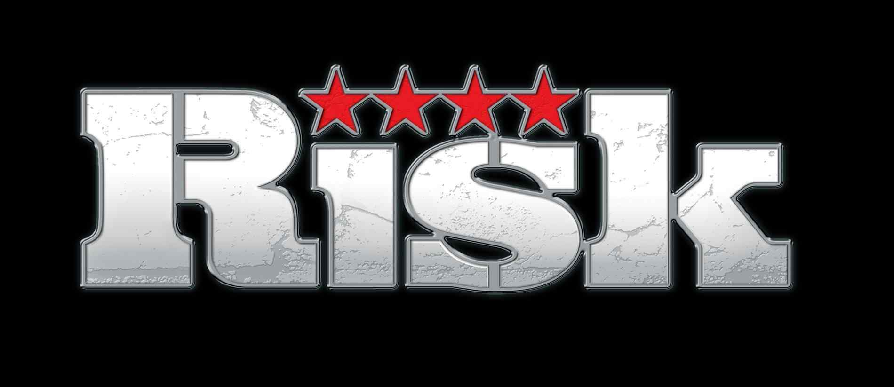

## Godot Game Engine

[Godot](https://godotengine.org/) is a 2D and 3D, cross-platform, free and open-source game engine released under the MIT license

## Risk Game 

> 🎨 The assets's design which used in demo copyrights to [SMG Studio](https://www.smgstudio.com/)  

## Project Team ✨

__________________
<table>
  <tr>
    <td align="center"><a> <b>Omar Hafez</b></a> <a title="Content">🖋</a> <a title="Code">💻</a> <a " title="Design">🎨</a> <a title="Project Management">📆</a></td>
    <td align="center"><a> <b>Omar Shagar</b></a> <a title="Ideas">🤔</a> <a title="Code">💻</a> <a " title="Design">🎨</a>
    <td align="center"><a> <b>Mohamed Zayan</b></a> <a title="Review">👀</a> <a title="Code">💻</a> <a " title="Design">🎨</a><a title="Bug">🐛</a>
  <td align="center"><a> <b>Mohamed El-feky</b></a> <a title="Test">⚠️</a> <a title="Code">💻</a> <a " title="Design">🎨</a>
      <td align="center"><a href="https://github.com/MoatazGamal"> <b>Moatz Gamal</b></a> <a title="Test">⚠️</a> <a title="Code">💻</a> <a " title="Design">🎨</a>
              <td align="center"><a> <b>Mahmoud M. Hosny</b></a> <a title="Test">⚠️</a> <a title="Code">💻</a> <a " title="Design">🎨</a>
